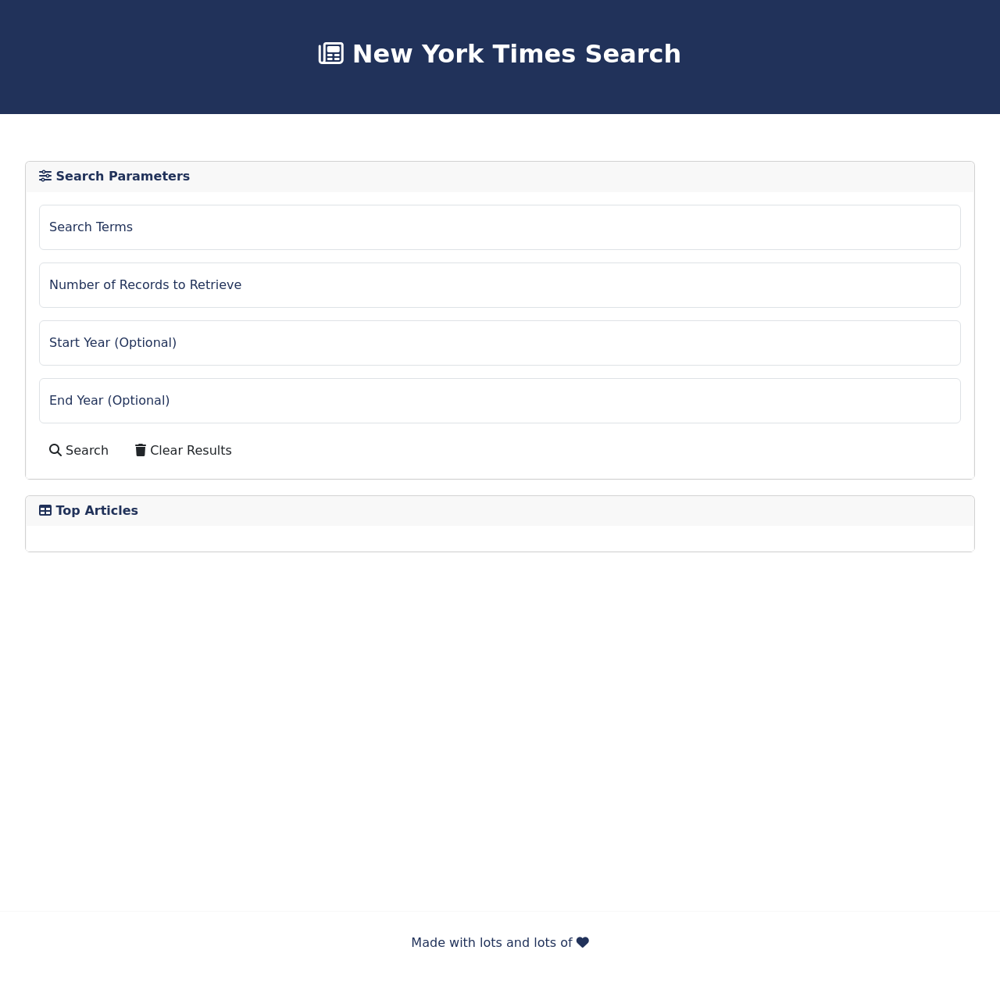

# Bootcamp Mini Project - New York Times Article Search
## Description 

This project was created using HTML, CSS, Bootstrap, Font Awesome, Javascript and JQuery to make a Article Search for the New York Times. The project had the following requirements:

* Make a page that looks like the following mock up:

* Create the layout for the design above using Bootstrap or to do something more customized of your own.
* Incorporate text boxes for capturing user input. Then research how to retrieve the input values in JavaScript.
* Use the [New York Times API](https://developer.nytimes.com/docs/articlesearch-product/1/overview).
* Create basic click events. Register the "Submit" button.
* Create working transfers of data between the text boxes and the back end.
* Experiment with creating content regions for where the article will go.
* Create the AJAX call needed to retrieve data, then console.log all of the relevant fields.
* Take note of various “bugs” that appear with certain searches.
* Display the HTML content!
* Continue polishing the display of content in the HTML.
* Consider adding styling or other jQuery tricks.
* Consider using Bootswatch and/or Font Awesome to add more visual appeal.
* Put in a hard effort to deal with bugs. How can you handle missing fields?

The page in this repo is the result.

## Installation

The site does not require installation steps.

## Usage 

The website can be viewed at [https://bowseruk.github.io/new-york-times-article-search/](https://bowseruk.github.io/new-york-times-article-search/) with Google Chrome. The source can be viewed in Chrome by right clicking and selecting inspect.

## Credits

* This site was based on a project by edX Boot Camps LLC.

* [W3School](https://www.w3schools.com/) was used as a reference for elements to use and good practice.

* The changes were checked with [W3C Validator](https://validator.w3.org/).

* [Stack Overflow](https://stackoverflow.com/) always seems to have the answer to a problem that occurs.

* [MDN](https://developer.mozilla.org/en-US/) is a very comprehensive and useful resource.

* [Font Awesome]() was used and the documentation referenced.

* [JQuery]() documentation was referred to throughout the project.

* [New York Times API](https://developer.nytimes.com/docs/articlesearch-product/1/overview) was used for the page. Also their [API console!](https://developer.nytimes.com/docs/articlesearch-product/1/routes/articlesearch.json/get).

## License

This project uses the licence in the LICENCE file of the repo.